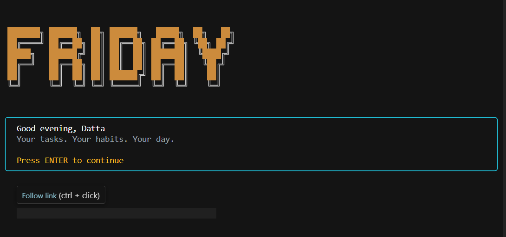
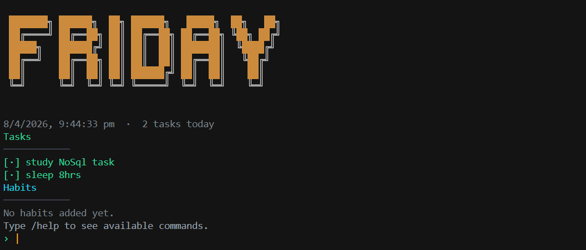
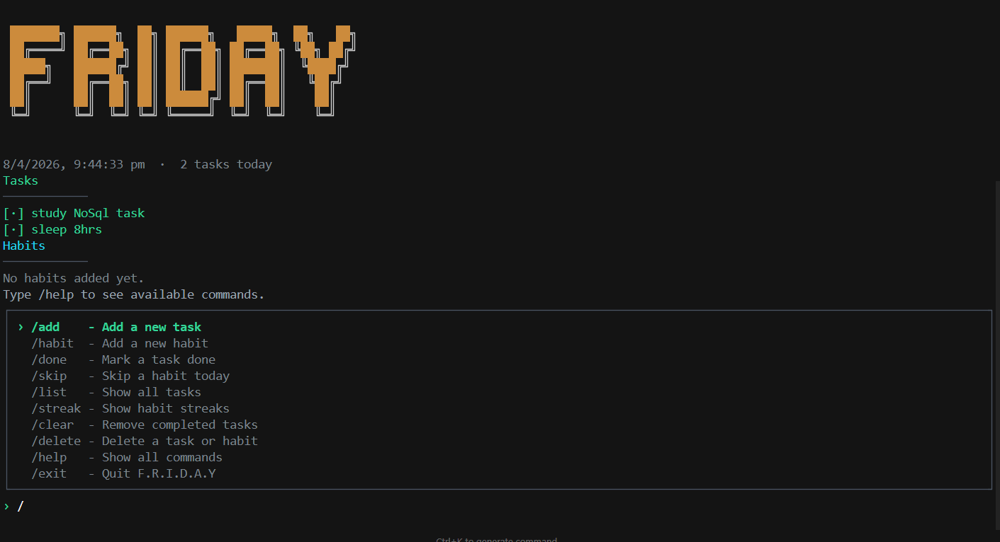
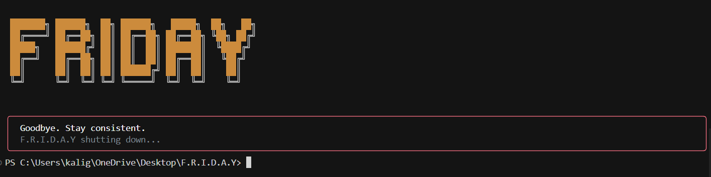

# F.R.I.D.A.Y ⚡

> A dry, fast, local-first terminal productivity CLI.  
> Tasks. Habits. Streaks. Personality included.

## 🌐 Live on npm
npm install -g @sridattasai_v/friday
friday

---

## ✨ Features

- **Task + Habit Tracking** — add, complete, skip, delete from the terminal
- **14-day Dot Row** — visual habit history (▓ done · ▒ skipped · ░ missed)
- **Streak Tracking** — per-habit streak counter with history log
- **Accent Color System** — entire UI palette derives from your chosen color
- **Personality Engine** — dry / warm / casual greeting styles via getResponse()
- **Interactive Settings** — arrow-key navigation, live preview, instant save
- **Smart Suggestions** — full command prefix matching as you type
- **Local First** — all data stays at ~/.friday/, no cloud, no accounts

---

## 🛠️ Tech Stack

- **Runtime:** Node.js 18+ (ESM modules throughout)
- **UI:** [Ink](https://github.com/vadimdemedes/ink) v7 + React 19
- **Banner:** [cfonts](https://github.com/dominikwilkowski/cfonts)
- **Storage:** Local JSON via filesystem (~/.friday/)
- **Build:** tsx

---

## 📦 Installation
npm install -g @sridattasai_v/friday

Then just run:
friday

Data and config are stored at `~/.friday/` — never inside the project.

---

## 💻 Commands

| Command | Description |
|---|---|
| `/add task <title>` | Add a task |
| `/add habit <title>` | Add a recurring habit |
| `/done <title>` | Mark a task or habit done |
| `/skip <title>` | Skip a habit for today |
| `/delete <title>` | Delete a task or habit |
| `/streak` | Show habit streaks |
| `/list` | Reload and display all tasks |
| `/clear` | Remove completed tasks |
| `/settings` | Open interactive settings panel |
| `/features` | Open power commands panel |
| `/help` | Show all commands |
| `/exit` | Quit F.R.I.D.A.Y |

---

## ⚙️ Settings

Open `/settings` — use **↑ ↓** to navigate, **← →** to change values:

| Setting | How to change |
|---|---|
| name | ENTER to edit · type · ENTER to confirm |
| greeting style | ← → to cycle dry / warm / casual |
| banner color | ← → for presets · `h` to type hex |
| banner font | ← → to cycle cfonts fonts |

All changes apply **instantly** and persist to `~/.friday/config.json`.

---

## 📁 Project Structure
F.R.I.D.A.Y/
├── bin/
│   └── friday.js          # Entry point — shebang + ESM dynamic import
├── src/
│   ├── app.jsx            # Main Ink component (~950 lines)
│   └── Onboarding.jsx     # First-launch onboarding flow
├── core/
│   ├── commands.js        # Task/habit mutations (addTask, markDone, etc.)
│   ├── storage.js         # Read/write ~/.friday/data.json
│   ├── personality.js     # getResponse() personality engine
│   └── config.js          # Read/write ~/.friday/config.json
└── package.json

---

## 📸 Screenshots

### Greeting screen

### Main dashboard

### Command suggestions

### Exit screen

---

## 🚀 Local Development
git clone https://github.com/Sridattasai18/Friday
cd Friday
npm install
npm start

---

## 🗺️ Roadmap

- **v1** — task + habit manager with personality engine ✅ (current)
- **v2** — smart suggestions based on your usage patterns
- **v3** — local AI agent via Ollama, fully offline, no API costs

---

## 🤝 Contributing

Issues and feature requests are welcome.  
Check the [issues page](https://github.com/Sridattasai18/Friday/issues).

---

## 📄 License

MIT © [sridattasai_v](https://github.com/Sridattasai18)

---

## 👤 Author

**Kaligotla Sri Datta Sai Vithal**

- GitHub: [@Sridattasai18](https://github.com/Sridattasai18)
- npm: [@sridattasai_v/friday](https://www.npmjs.com/package/@sridattasai_v/friday)

---

⭐ Star this repo if F.R.I.D.A.Y helps your day.